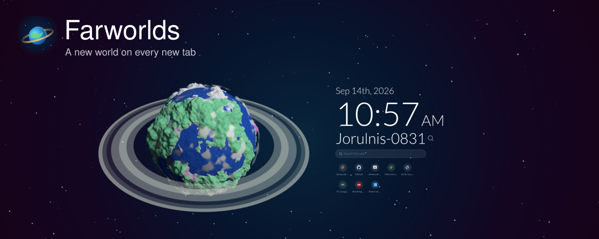
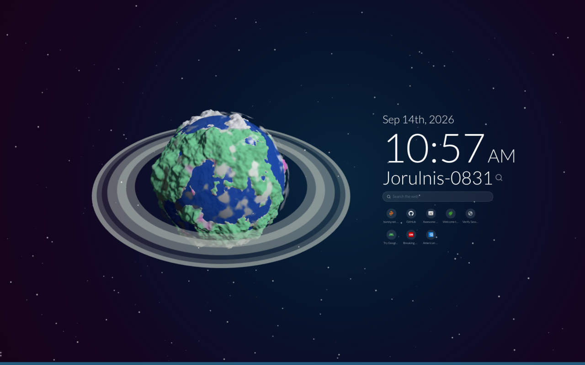
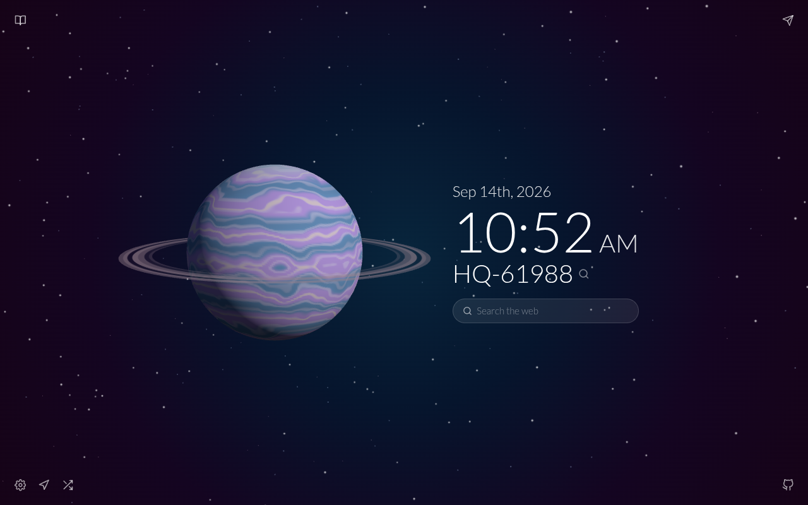
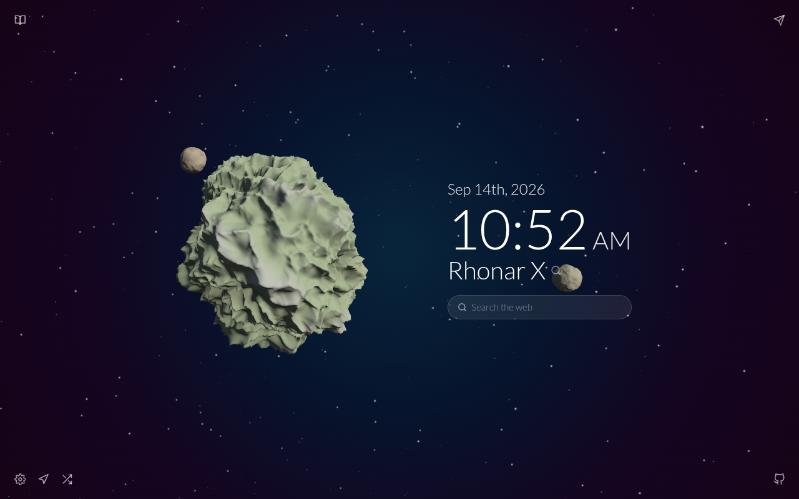
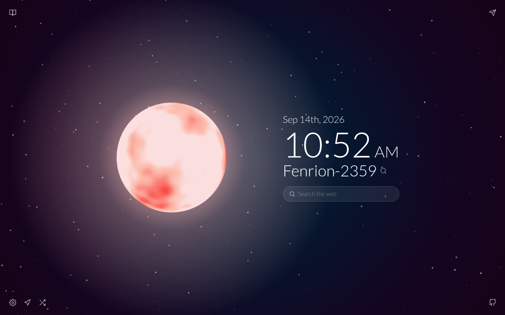

<p align="center">
  
</p>

<p align="center">
  <a href="https://github.com/JalapenoLabs/FarWorlds/actions/workflows/ci.yml"></a>
  <a href="https://github.com/JalapenoLabs/FarWorlds/releases/latest"></a>
  <a href="LICENSE"></a>
  
  
</p>

<h1 align="center">Farworlds</h1>

<p align="center"><strong>A new world on every new tab.</strong></p>

Farworlds replaces your browser's new tab page with a procedurally generated planet, star, gas giant or asteroid rendered in 3D, drifting in a field of stars beside the time and date. Every world comes from a coordinate you can copy and share, and the same coordinate always shows the same world.

Drag to orbit, scroll to zoom. Shuffle for a random world, travel to exact coordinates, and keep a logbook of where you have been and the worlds you want to see again. Optional widgets add a search bar that uses your browser's default engine and a row of your most visited sites.

No account, no network requests, no tracking. Everything is generated and stored on your machine.

## Install

**Chrome Web Store**: listing in review. This section gets the link the moment it is live.

**From a release**: download `farworlds-<version>.zip` from the [latest release](https://github.com/JalapenoLabs/FarWorlds/releases/latest), unzip it, open `chrome://extensions`, turn on Developer mode, choose **Load unpacked** and pick the unzipped folder. Open a new tab.

## Worlds

| | |
| --- | --- |
| **Ocean worlds** | Continents, beaches, mountains, ice caps and drifting clouds, in a palette rolled per world |
| **Island and ridge worlds** | Scattered archipelagos, or continents dominated by ridged mountain ranges |
| **Bare worlds and asteroids** | Airless rock shaded by height, often with a moon or two |
| **Stars** | Glowing surfaces with a corona that lights nearby space |
| **Gas giants** | Banded, turbulent atmospheres, usually ringed |

Rings, moons and cloud colour are rolled from the same seed as everything else, so a shared coordinate reproduces the whole system.

## Develop

Requires Node 24.13.0 and Yarn 4.17.0 (via Corepack). Both are pinned.

```bash
corepack enable
yarn install
yarn build       # writes dist/, the folder to load unpacked
yarn typecheck
yarn lint
yarn test
```

Reload the extension card in `chrome://extensions` after each build and open a fresh tab. For a visual check without the browser UI, serve `dist/` statically and drive it with `scripts/ui-screenshots.mjs`.

## How it works

- **Deterministic worlds**: a coordinate becomes a seed string, and each subsystem (type, terrain, palette, features, name, stats) derives its own random stream from it. See `docs/architecture.md`.
- **Terrain**: a cube sphere displaced by layered simplex noise in the style of Sebastian Lague's Procedural Planets, generated in a worker pool, welded so no seams show, coloured per vertex by height, moisture and latitude.
- **Rendering**: three.js, with clouds as a GLSL noise shell and star glow, ring bands and star sprites drawn on canvases at runtime. No image assets ship.
- **State**: Redux Toolkit, persisted to the page's local storage.

Docs live in `docs/`: architecture and decisions, the behaviour spec, and the research that started it. Store listing copy and assets live in `store/`.

## Screenshots

<table>
  <tr>
    <td></td>
    <td></td>
  </tr>
  <tr>
    <td></td>
    <td></td>
  </tr>
</table>

## Authors and license

Made by [JalapenoLabs](https://jalapenolabs.io) and Alex Navarro (alex@jalapenolabs.io). MIT licensed; see `LICENSE`. Issues and pull requests are welcome at https://github.com/JalapenoLabs/FarWorlds.

Farworlds is a clean-room reimagining of the Tabiverse idea and shares no code with it.

## Credits

Terrain generation follows Sebastian Lague's [Procedural Planets](https://github.com/SebLague/Procedural-Planets) (MIT). GLSL simplex noise by Ian McEwan, Ashima Arts (MIT). Lato by Łukasz Dziedzic (SIL OFL 1.1).
